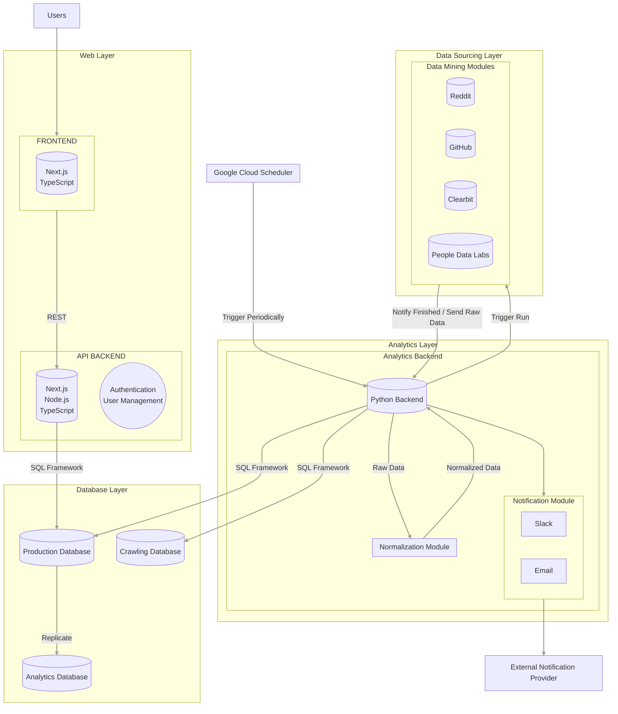
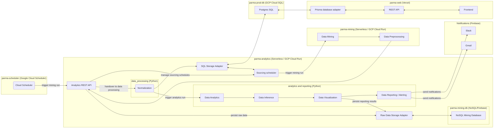
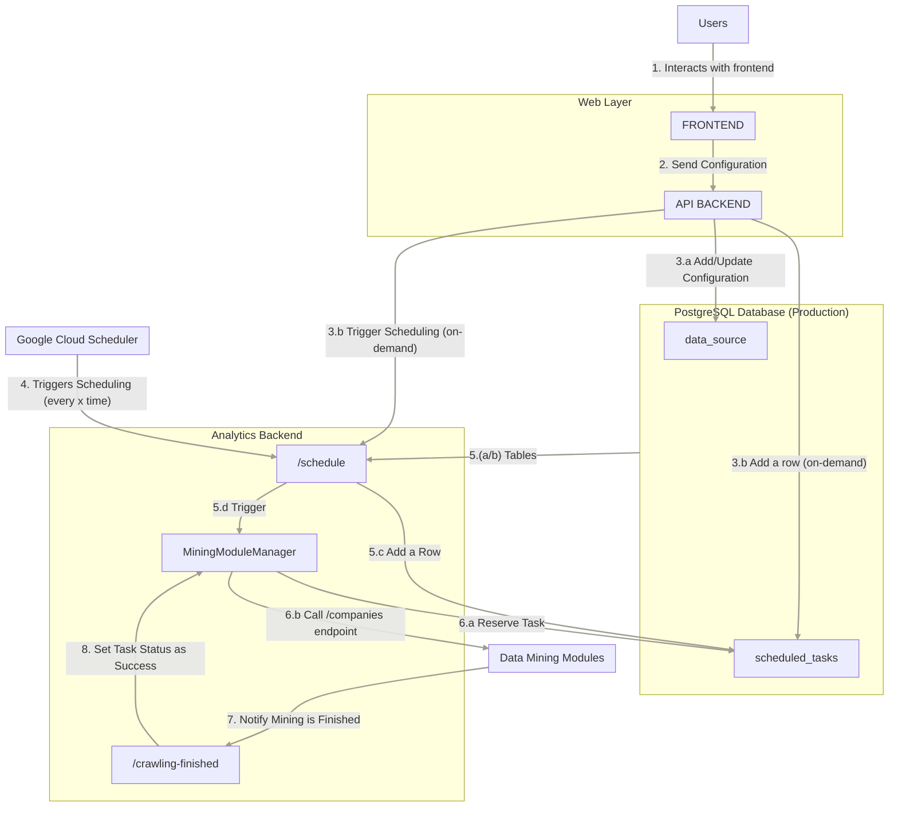
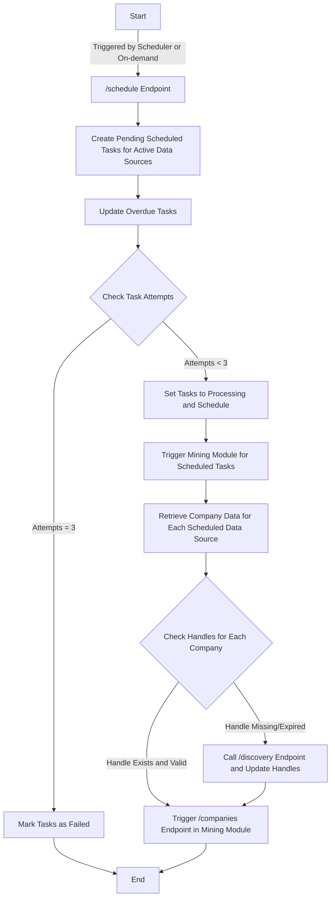

# parma-analytics

[](https://github.com/la-famiglia-jst2324/parma-analytics/actions/workflows/chore.yml)
[](https://github.com/la-famiglia-jst2324/parma-analytics/actions/workflows/ci.yml)
[](https://github.com/la-famiglia-jst2324/parma-analytics/actions/workflows/deploy.yml)
[](https://github.com/la-famiglia-jst2324/parma-analytics/actions/workflows/deploy.yml)
[](https://github.com/la-famiglia-jst2324/parma-analytics/actions/workflows/tag-major.yml)

## Project Description

ParmaAI is a sophisticated platform combining advanced data mining with comprehensive analytics. At its core, Parma Analytics orchestrates the data lifecycle, scheduling and managing data mining modules, and processing the extracted data using tools like ChatGPT for in-depth analysis and report generation. Complementing this, Parma Web provides a user-friendly interface for data management and visualization, making the system's complex functionalities accessible and intuitive. Together, they form a powerful solution for businesses to monitor, analyze, and respond to corporate anomalies, leveraging data-driven insights for strategic decision-making.

### parma-analytics

Parma Analytics is the dynamic engine at the heart of the ParmaAI ecosystem, playing a multifaceted role in data processing, analysis, and orchestration. Beyond analyzing data and generating insightful reports with tools like ChatGPT, it is also tasked with the critical function of scheduling and managing interactions with data mining modules. This repository is key for contributors focused on enhancing our system's capability to not only process and analyze data but also to efficiently coordinate the various stages of data mining. It's a nexus for integrating complex workflows, scheduling tasks, and ensuring seamless communication between different data mining modules.

## `parma-ai` architecture

The parma analytics backend is the heart of the system connecting the data mining processes with the frontend stack while being responsible for analytics and inference.

### system's architecture

The parma ai backend consists of the following process flow:


#### Detailed architecture



#### Data flow diagram



#### Process flow diagram: Mining Scheduling



#### Activity diagram: Mining Scheduling



## How to add new data sources

[ADDING_DATASOURCES.md](./docs/ADDING_DATASOURCES.md)

## Getting Started

The following steps will get you started with the project.

> **NOTE**: Although the general steps should also work on a Windows, we highly recommend to use a Linux based machine for development. WSL is also an option. Use Windows at your own risk.

1. Pre-requisites: to be able to contribute to JST in this repository, make sure to comply with the following prerequisites.

   - Configure GitHub via an ssh key. Key based authenticated is highly encouraged. See [GitHub Docs](https://docs.github.com/en/github/authenticating-to-github/connecting-to-github-with-ssh) for more information.
   - Please make sure to have an GPG key configured for GitHub. See [GitHub Docs](https://docs.github.com/en/authentication/managing-commit-signature-verification/adding-a-gpg-key-to-your-github-account) for more information.
   - Install **micromamba**, a conda environment management package manager, as described [here](https://mamba.readthedocs.io/en/latest/micromamba-installation.html). Alternatively conda or mamba installations should also work, but are highly discouraged because of their slow performance.
   - Install docker and docker-compose. See [Docker Docs](https://docs.docker.com/get-docker/) for more information.

2. **Clone the repository**

   ```bash
   git@github.com:la-famiglia-jst2324/parma-analytics.git
   ```

3. **Precommit & environment setup**:

   ```bash
   # spinning up the database container for local development
   docker-compose up -d

   make install
   ```

4. Activating the environment:

   ```bash
    # Activate the new environment (do this every time you start a new terminal)
    # fyi. there are IDE extensions to automatically activate the environment
    micromamba activate parma-analytics

    # do the following only once
    pip install -e . # Install the project in editable mode
    pre-commit install
   ```

5. Export environment variables for the database:

   ```bash
   # fyi. there are IDE extensions to automatically load
   # environment variables from a .env file
   export POSTGRES_HOST=localhost
   export POSTGRES_PORT=9000
   export POSTGRES_USER=parma-prod-db
   export POSTGRES_PASSWORD=parma-prod-db
   export POSTGRES_DB=parma-prod-db
   ```

6. **Start the api server**:

   ```bash
   make dev
   ```

   **Open [http://localhost:8000](http://localhost:8000) with your browser to see the result.**

   FastApi will provide you with an interactive documentation of the api. You can also use the swagger ui at [http://localhost:8000/docs](http://localhost:8000/docs) or the redoc ui at [http://localhost:8000/redoc](http://localhost:8000/redoc).

7. Optional: Running the pre-commit pipeline manually

   ```bash
   pre-commit run --all
   ```

8. Test your code:

   ```bash
   make test
   ```

9. Setup the Firestore DB (if necessary):

   If you want to connect to the crawling database, where we save the raw data, you have to get the credentials from the [Notion](https://www.notion.so/firebase-admin-sdk-certificate-4279aa3b4e904e1b927619ed69537045).
   Then create `.secrets` folder in the main directory (or use the existing one) and add the credentials in a new file named `la-famiglia-parma-ai-firebase-adminsdk.json`.

10. Setup the Firestore Emulator (for local testing):

    Follow the instructions in [Notion](https://www.notion.so/Firestore-Emulator-for-Local-Testing-17edf65f9db2402a8f2118f0ca7d80a0?pvs=4) to setup and use the Firestore Emulator.

## Sendgrid

- Add the [environment variables](https://www.notion.so/Sendgrid-environment-variables-07b749c85d894d51bb07c8b5375aa533) in your local.

## ChatGPT

- Add the [environment variables](https://www.notion.so/ChatGPT-Dev-API-KEY-2e7ffc39500943a595c31084cd24379e) in your local.

## Get Started with Slack Notifications:

To ensure you're set up to receive messages in your Slack channel, simply follow these steps:

1.  **Create Your Slack App**: Head over to the [Slack messaging documentation](https://api.slack.com/messaging/sending) and set up a Slack App for your workspace. Pay special attention to the _Requesting the necessary permissions_ section to get your app up and running.

2.  **Invite Your Slack Bot**: Once your app is ready, bring it into the conversation by inviting it to the desired channel(s):

    - In the message field of your Slack channel, type `/invite @YourAppName` and hit enter. Be sure to replace `YourAppName` with the actual name of your app.

3.  **Connect to Parma AI**:
    - Locate your `Bot User OAuth Token` on your Slack App's page under the `OAuth & Permissions` section.
    - Enter this token and your desired Slack channel name(s) into the corresponding fields in your Parma AI settings.

And that's it! You're all set to receive notifications through Parma AI in your selected Slack channel.

## PR workflow

1. **Create a new branch**
   [linear.app](linear.app) offers a button to copy branch names from tickets.
   In case there is no ticket, please use feel free to use an arbitrary name or create a ticket.
   GitHub CI doesn't care about the branch name, only the PR title matters.

   ```bash
   # format: e.g. robinholzingr/meta-1-create-archtecture-drafts-diagrams-list-of-key-priorities
   git checkout -b <branch-name>
   ```

2. Open a PR and use a [conventional commit](https://www.conventionalcommits.org/en/v1.0.0/) PR title.

3. Wait for CI pipeline to pass and if you are happy with your changes request a review.

4. Merge the PR (using the "Squash and merge" option) and delete the branch.
   Pay attention to include co-authors if anyone else contributed to the PR.

5. If you want to release a new version to production, create a new release on GitHub.
   The release version will be automatically derived from the PR titles
   (breaking changes yield new major versions, new features yield new minor versions).

### Directory structure

```bash
.
├── parma_analytics: Main package for analytics backend
│   ├── analytics: subpackage for main analytical tasks
│   │   ├── inference: subpackage for custom models and inference
│   │   └── visualization
│   ├── api
│   │   ├── README.md: Guidelines for api design
│   │   ├── main.py: Api entrypoint for fastapi
│   │   ├── models: pydantic models for api
│   │   │   ├── README.md: Guidelines for pydantic models
│   │   │   └── dummy.py: Example pydantic models
│   │   └── routes: api routes for fastapi
│   │       └── dummy.py: Example api routes
│   ├── bl: Business logic for analytics backend
│   ├── db: Database subpackage
│   │   ├── mining: subpackage for mining database
│   │   └── prod: subpackage for production database
│   │       ├── README.md
│   │       ├── dummy.py: Example database connectors
│   │       ├── engine.py: Database engine utility
│   │       ├── models: Database models
│   │       │   ├── README.md: Guidelines for database models
│   │       │   ├── base.py: Base database model
│   │       │   └── dummy.py: Example database models
│   │       └── utils: Database utilities
│   │           └── paginate.py: Pagination utility
│   ├── etl: Data processing subpackage
│   └── reporting: Reporting subpackage
│       ├── gmail: subpackage for gmail reporting
│       └── slack: subpackage for slack reporting
├─ tests:
│   ├── analytics
│   │   ├── inference
│   │   └── visualization
│   ├── api
│   ├── db
│   ├── etl
│   ├── reporting
│   │   ├── gmail
│   │   └── slack
│   └── test_dummy.py
├── Makefile: Recipes for easy simplified setup and local development
├── README.md
├── docker-compose.yml: Docker compose file for local database
├── environment.yml: conda environment file
├── pyproject.toml: Python project configuration file
```

## Tech Stack

Core libraries that this project uses:

- [FastAPI](https://fastapi.tiangolo.com/): FastAPI is a modern, fast (high-performance), web framework for building APIs with Python 3.6+ based on standard Python type hints.
- [SQLAlchemy](https://www.sqlalchemy.org/): SQLAlchemy is the Python SQL toolkit and Object Relational Mapper that gives application developers the full power and flexibility of SQL.
- [Alembic](https://alembic.sqlalchemy.org/en/latest/): Alembic is a lightweight database migration tool for usage with the SQLAlchemy Database Toolkit for Python.
- [Pydantic](https://pydantic-docs.helpmanual.io/): Data validation and settings management using python type annotations.
- [Typer](https://typer.tiangolo.com/): Typer is a library for building CLI applications that users will love using and developers will love creating.
- [Polars](https://pola.rs): Polars is a blazingly fast data processing library written in Rust. It has a DataFrame API that is similar to Pandas and a Series API that is similar to NumPy.
- [Pytest](https://docs.pytest.org/en/6.2.x/): The pytest framework makes it easy to write small tests, yet scales to support complex functional testing for applications and libraries.
- **ML**: For potential ML tasks we will start off with sklearn and lightgbm. If we need more complex models we will switch to pytorch or tensorflow.

## Deployment

The deployment of Parma Analytics is managed through a combination of Terraform for infrastructure management and GitHub Actions for continuous integration and delivery. Our deployment strategy ensures that our application is consistently deployed across different environments with high reliability and minimal manual intervention.

### Infrastructure as Code with Terraform

We use Terraform for defining, provisioning, and managing the cloud infrastructure required for Parma Analytics. Our Terraform configuration files are organized under the terraform directory, divided into different environments like staging (staging), and production (prod). Each environment has its own set of configurations and variables, ensuring isolation and control over different deployment stages.

A pivotal aspect of our Terraform strategy is the use of a common module, which is housed in the `module` directory. This module encompasses the core infrastructure components that are shared across all environments. The utilization of a shared module ensures consistency and streamlines our infrastructure management.

Each environment, staging and production, references this common module but with its own set of environment-specific configurations and variables. This structure ensures that each environment, while based on a common foundation, is independently configurable and isolated, thus providing precise control over the deployment in various stages.

Key components of our infrastructure include:

- **Google Cloud SQL for PostgreSQL**: We provision a PostgreSQL database instance with `google_sql_database_instance` and `google_sql_database` resources for storing application data. These are configured in the `database.tf` file in the module folder.
- **Google Cloud Run**: The application is containerized and deployed to Google Cloud Run, providing a scalable and serverless environment for running our APIs. This is defined in `service.tf`.
- **Google Cloud Scheduler**: Scheduled jobs for data sourcing and report generation are managed using Google Cloud Scheduler, as defined in `scheduler.tf`.

### Continuous Deployment with GitHub Actions

Our GitHub Actions workflow, defined in `.github/workflows/deploy.yml`, automates the deployment process. The workflow is triggered on pushes to the main branch and on published releases. It encompasses steps for:

- Setting up the Google Cloud CLI and authenticating with Google Cloud services.
- Building and pushing Docker images to Google Container Registry.
- Executing Terraform commands (`init`, `plan`, `apply`) to deploy the infrastructure and services as per the Terraform configurations.
- Environment-specific variables and secrets (like database passwords, API keys, etc.) are securely managed through GitHub Secrets and are injected into the deployment process as needed.

### Deployment Environments

We maintain two primary environments for our application:

- Staging (staging): A pre-production environment that closely resembles the production setup, used for final testing before a release.
- Production (prod): The live environment where our application is available to end-users.

## Disclaimer

In case there are any issues with the initial setup or important architectural decisions/integrations missing, please contact the meta team or @robinholzi directly.
