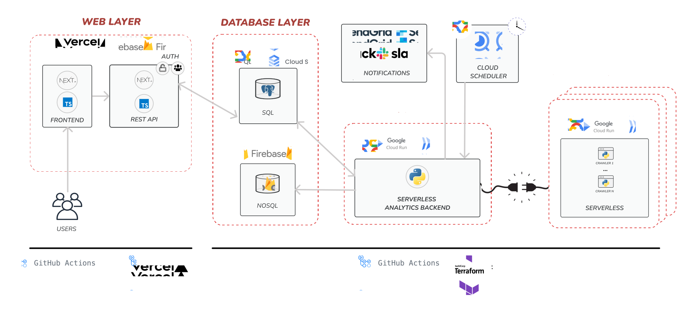

# parma-analytics

[](https://github.com/la-famiglia-jst2324/parma-analytics/actions/workflows/chore.yml)
[](https://github.com/la-famiglia-jst2324/parma-analytics/actions/workflows/ci.yml)
[](https://github.com/la-famiglia-jst2324/parma-analytics/actions/workflows/deploy.yml)
[](https://github.com/la-famiglia-jst2324/parma-analytics/actions/workflows/deploy.yml)
[](https://github.com/la-famiglia-jst2324/parma-analytics/actions/workflows/tag-major.yml)

ParmaAI analytics repository providing data processing and inference.

## `parma-ai` architecture

The parma analytics backend is the heart of the system connecting the data mining processes with the frontend stack while being responsible for analytics and inference.

### system's architecture

The parma ai backend consists of the following process flow:



#### Detailed architecture


## How to add new data sources

[ADDING_DATASOURCES.md](./docs/ADDING_DATASOURCES.md)

## Getting Started

The following steps will get you started with the project.

> **NOTE**: Although the general steps should also work on a Windows, we highly recommend to use a Linux based machine for development. WSL is also an option. Use Windows at your own risk.

1. Pre-requisites: to be able to contribute to JST in this repository, make sure to comply with the following prerequisites.

   - Configure GitHub via an ssh key. Key based authenticated is highly encouraged. See [GitHub Docs](https://docs.github.com/en/github/authenticating-to-github/connecting-to-github-with-ssh) for more information.
   - Please make sure to have an GPG key configured for GitHub. See [GitHub Docs](https://docs.github.com/en/authentication/managing-commit-signature-verification/adding-a-gpg-key-to-your-github-account) for more information.
   - Install **micromamba**, a conda environment management package manager, as described [here](https://mamba.readthedocs.io/en/latest/micromamba-installation.html). Alternatively conda or mamba installations should also work, but are highly discouraged because of their slow performance.
   - Install docker and docker-compose. See [Docker Docs](https://docs.docker.com/get-docker/) for more information.

2. **Clone the repository**

   ```bash
   git@github.com:la-famiglia-jst2324/parma-analytics.git
   ```

3. **Precommit & environment setup**:

   ```bash
   # spinning up the database container for local development
   docker-compose up -d

   make install
   ```

4. Activating the environment:

   ```bash
    # Activate the new environment (do this every time you start a new terminal)
    # fyi. there are IDE extensions to automatically activate the environment
    micromamba activate parma-analytics

    # do the following only once
    pip install -e . # Install the project in editable mode
    pre-commit install
   ```

5. Export environment variables for the database:

   ```bash
   # fyi. there are IDE extensions to automatically load
   # environment variables from a .env file
   export POSTGRES_HOST=localhost
   export POSTGRES_PORT=9000
   export POSTGRES_USER=parma-prod-db
   export POSTGRES_PASSWORD=parma-prod-db
   export POSTGRES_DB=parma-prod-db
   ```

6. **Start the api server**:

   ```bash
   make dev
   ```

   **Open [http://localhost:8000](http://localhost:8000) with your browser to see the result.**

   FastApi will provide you with an interactive documentation of the api. You can also use the swagger ui at [http://localhost:8000/docs](http://localhost:8000/docs) or the redoc ui at [http://localhost:8000/redoc](http://localhost:8000/redoc).

7. Optional: Running the pre-commit pipeline manually

   ```bash
   pre-commit run --all
   ```

8. Test your code:

   ```bash
   make test
   ```

9. Setup the Firestore DB (if necessary):

   If you want to connect to the crawling database, where we save the raw data, you have to get the credentials from the [Notion](https://www.notion.so/firebase-admin-sdk-certificate-4279aa3b4e904e1b927619ed69537045).
   Then create ".secrets" folder in the main directory (or use the existing one) and add the credentials in a new file named "la-famiglia-parma-ai-firebase-adminsdk.json".

## PR workflow

1. **Create a new branch**
   [linear.app](linear.app) offers a button to copy branch names from tickets.
   In case there is no ticket, please use feel free to use an arbitrary name or create a ticket.
   GitHub CI doesn't care about the branch name, only the PR title matters.

   ```bash
   # format: e.g. robinholzingr/meta-1-create-archtecture-drafts-diagrams-list-of-key-priorities
   git checkout -b <branch-name>
   ```

2. Open a PR and use a [conventional commit](https://www.conventionalcommits.org/en/v1.0.0/) PR title.

3. Wait for CI pipeline to pass and if you are happy with your changes request a review.

4. Merge the PR (using the "Squash and merge" option) and delete the branch.
   Pay attention to include co-authors if anyone else contributed to the PR.

5. If you want to release a new version to production, create a new release on GitHub.
   The release version will be automatically derived from the PR titles
   (breaking changes yield new major versions, new features yield new minor versions).

### Directory structure

```bash
.
├── parma_analytics: Main package for analytics backend
│   ├── analytics: subpackage for main analytical tasks
│   │   ├── inference: subpackage for custom models and inference
│   │   └── visualization
│   ├── api
│   │   ├── README.md: Guidelines for api design
│   │   ├── main.py: Api entrypoint for fastapi
│   │   ├── models: pydantic models for api
│   │   │   ├── README.md: Guidelines for pydantic models
│   │   │   └── dummy.py: Example pydantic models
│   │   └── routes: api routes for fastapi
│   │       └── dummy.py: Example api routes
│   ├── bl: Business logic for analytics backend
│   ├── db: Database subpackage
│   │   ├── mining: subpackage for mining database
│   │   └── prod: subpackage for production database
│   │       ├── README.md
│   │       ├── dummy.py: Example database connectors
│   │       ├── engine.py: Database engine utility
│   │       ├── models: Database models
│   │       │   ├── README.md: Guidelines for database models
│   │       │   ├── base.py: Base database model
│   │       │   └── dummy.py: Example database models
│   │       └── utils: Database utilities
│   │           └── paginate.py: Pagination utility
│   ├── etl: Data processing subpackage
│   └── reporting: Reporting subpackage
│       ├── gmail: subpackage for gmail reporting
│       └── slack: subpackage for slack reporting
├─ tests:
│   ├── analytics
│   │   ├── inference
│   │   └── visualization
│   ├── api
│   ├── db
│   ├── etl
│   ├── reporting
│   │   ├── gmail
│   │   └── slack
│   └── test_dummy.py
├── Makefile: Recipes for easy simplified setup and local development
├── README.md
├── docker-compose.yml: Docker compose file for local database
├── environment.yml: conda environment file
├── pyproject.toml: Python project configuration file
```

## Tech Stack

Core libraries that this project uses:

- [FastAPI](https://fastapi.tiangolo.com/): FastAPI is a modern, fast (high-performance), web framework for building APIs with Python 3.6+ based on standard Python type hints.
- [SQLAlchemy](https://www.sqlalchemy.org/): SQLAlchemy is the Python SQL toolkit and Object Relational Mapper that gives application developers the full power and flexibility of SQL.
- [Alembic](https://alembic.sqlalchemy.org/en/latest/): Alembic is a lightweight database migration tool for usage with the SQLAlchemy Database Toolkit for Python.
- [Pydantic](https://pydantic-docs.helpmanual.io/): Data validation and settings management using python type annotations.
- [Typer](https://typer.tiangolo.com/): Typer is a library for building CLI applications that users will love using and developers will love creating.
- [Polars](https://pola.rs): Polars is a blazingly fast data processing library written in Rust. It has a DataFrame API that is similar to Pandas and a Series API that is similar to NumPy.
- [Pytest](https://docs.pytest.org/en/6.2.x/): The pytest framework makes it easy to write small tests, yet scales to support complex functional testing for applications and libraries.
- **ML**: For potential ML tasks we will start off with sklearn and lightgbm. If we need more complex models we will switch to pytorch or tensorflow.

## Deployment

No deployment pipeline has been set up yet.

Currently we are considering several backend frameworks like `Firebase`, `Supabase` or `AWS Amplify`.

## Disclaimer

In case there are any issues with the initial setup or important architectural decisions/integrations missing, please contact the meta team or @robinholzi directly.
