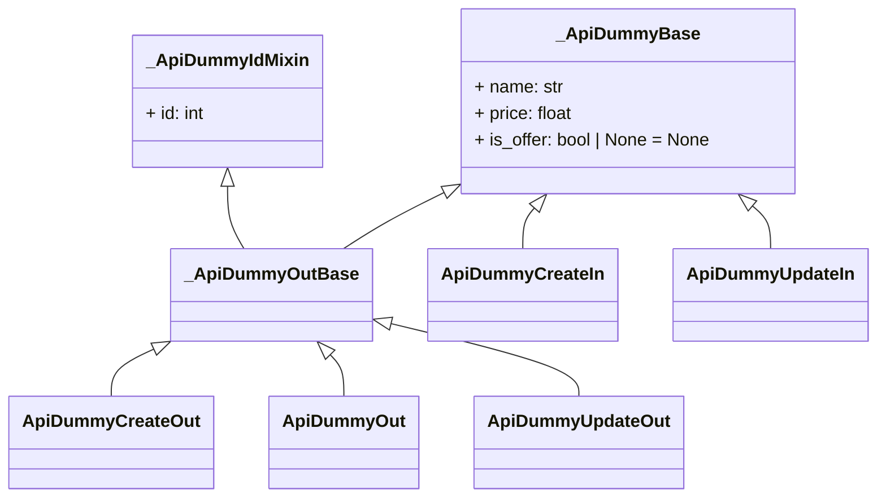

# FastAPI Models

## Overview

This package contains a set of FastAPI model classes following a consistent naming convention and structure. The goal is to provide clarity and consistency in the representation of input and output models, especially when dealing with CRUD (Create, Read, Update, Delete) operations.

## Naming Convention

Model classes are prefixed with "Api," and their names are constructed using the following conventions:

- **Input Models**: Names end with the "In" postfix.
- **Output Models**: Names end with the "Out" postfix.

In cases where there are differences in CRUD operation flows, the models can be suffixed with the operation name (e.g., Create, Update, Delete, Get).

### Naming Structure

The naming convention follows the pattern: `Api<modelname><operation><accessscope><in/out>`

Examples:

- `ApiCompanyIn`
- `ApiCompanyOut`
- `ApiUserCreateIn`
- `ApiUserCreateOut`
- `ApiUserUpdateIn`
- `ApiUserUpdateOut`

Mixins are encouraged to add a set of common fields to several models, promoting reusability and reducing redundancy.

## Inheritance and BaseModel

To avoid code duplication, inheritance and internal (private) classes/basemodels are recommended. This helps streamline the structure and maintainability of the codebase.

## Model DAG

The entire API model structure is depicted as a Directed Acyclic Graph (DAG) in the mermaid syntax. Please refer to the mermaid diagram below for a visual representation of the relationships between different model classes.

