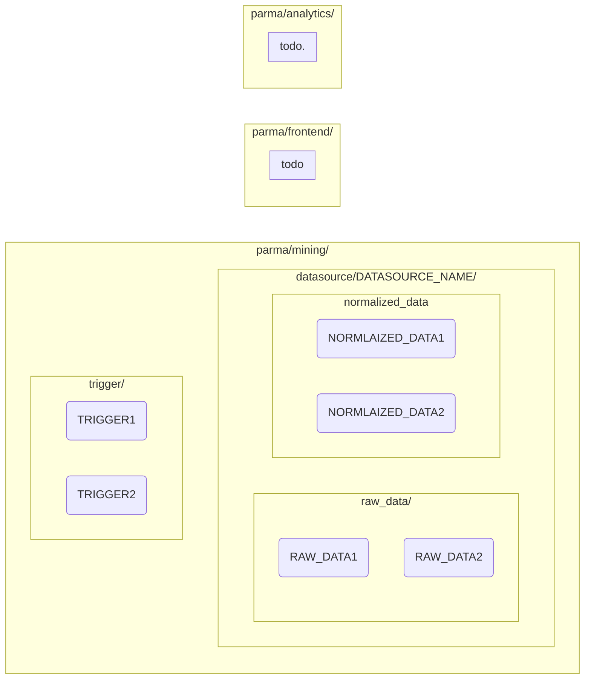
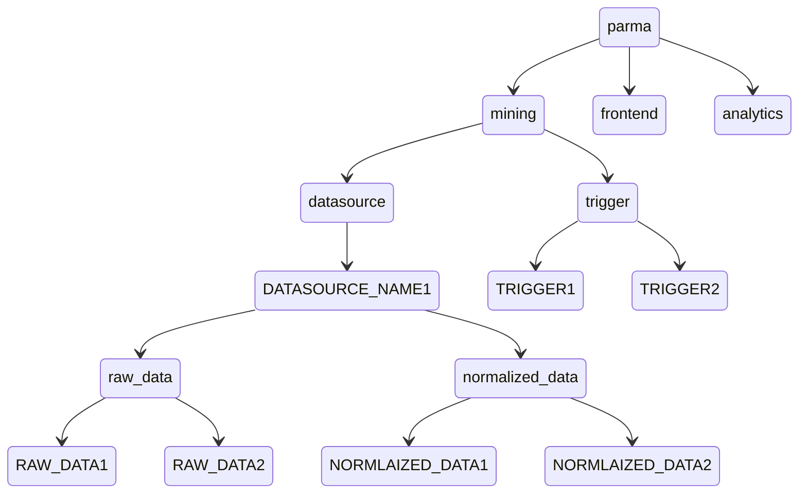
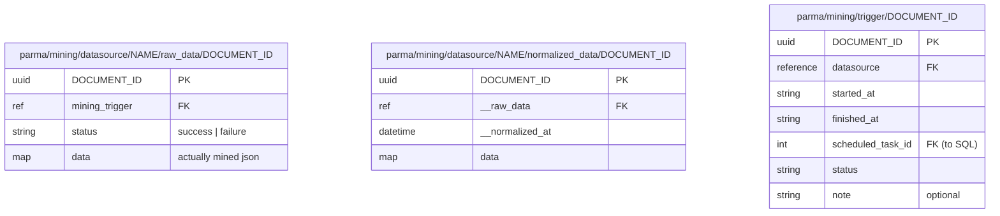

# Firestore database

## Database schema

### Collection hierarchy

#### visualization as collection

```mermaid
graph LR;
    subgraph parma/mining/
        subgraph datasource/DATASOURCE_NAME/
            subgraph raw_data/
                ut1(RAW_DATA1)
                ut2(RAW_DATA2)
            end
            subgraph normalized_data
                ut3(NORMLAIZED_DATA1)
                ut4(NORMLAIZED_DATA2)
            end
        end
        subgraph trigger/
            ut5(TRIGGER1)
            ut6(TRIGGER2)
        end
    end
    subgraph parma/frontend/
        subgraph todo
        end
    end
    subgraph parma/analytics/
        subgraph todo.
        end
    end
```

#### visualization as tree

```mermaid
stateDiagram-v2
    parma --> mining
        mining --> datasource
        mining --> trigger
        datasource --> DATASOURCE_NAME1
        DATASOURCE_NAME1 --> raw_data
        DATASOURCE_NAME1 --> normalized_data

            raw_data --> RAW_DATA1
            raw_data --> RAW_DATA2

            normalized_data --> NORMLAIZED_DATA1
            normalized_data --> NORMLAIZED_DATA2

        trigger --> TRIGGER1
        trigger --> TRIGGER2

    parma --> frontend
    parma --> analytics
```

### Document models

```mermaid
erDiagram
    "parma/mining/datasource/NAME/raw_data/DOCUMENT_ID" {
        uuid DOCUMENT_ID "PK"
        ref mining_trigger "FK"
        string status "success | failure"
        map data "actually mined json"
    }
    "parma/mining/datasource/NAME/normalized_data/DOCUMENT_ID" {
        uuid DOCUMENT_ID "PK"
        ref __raw_data "FK"
        datetime __normalized_at
        map data ""
    }
    "parma/mining/trigger/DOCUMENT_ID" {
        uuid DOCUMENT_ID "PK"
        reference datasource "FK"
        string started_at ""
        string finished_at ""
        int scheduled_task_id "FK (to SQL)"
        string status ""
        string note "optional"
    }
```
