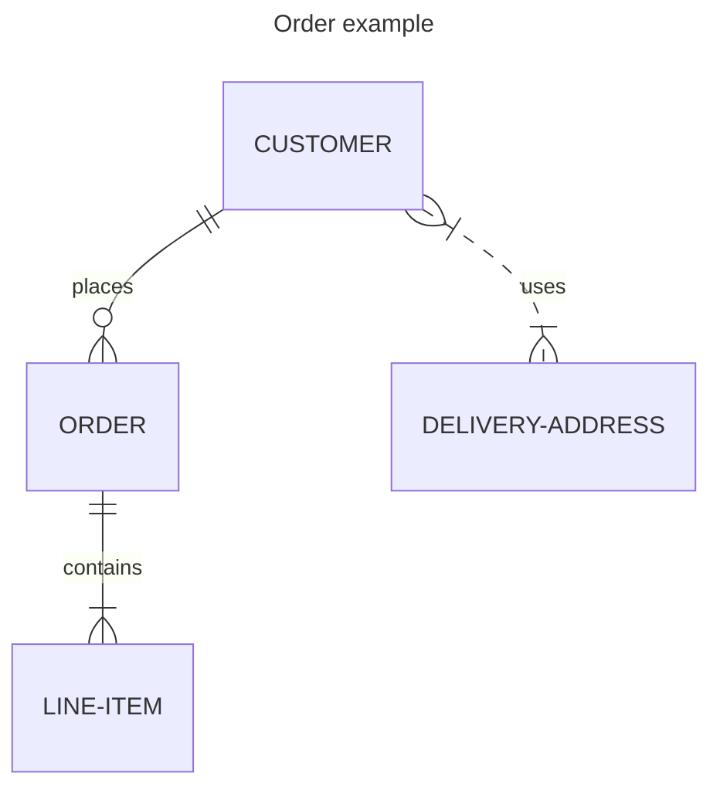

# parma-prod-db ORM models

## ER Diagram

> TODO: Update dummy diagram once we have the real one.

```mermaid
---
title: Order example
---
erDiagram
    CUSTOMER ||--o{ ORDER : places
    ORDER ||--|{ LINE-ITEM : contains
    CUSTOMER }|..|{ DELIVERY-ADDRESS : uses
```
