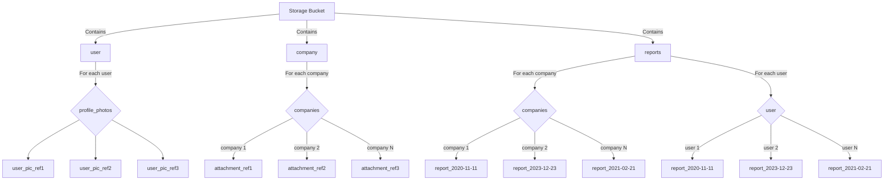

# Firebase storage schema

The diagram provided illustrates the Firebase storage structure specific to our project.
Within this schema, it's important to note that for the analytics repository, only the
'reports' branch is pertinent. This branch is utilized for both storing generated
reports and retrieving stored ones.

